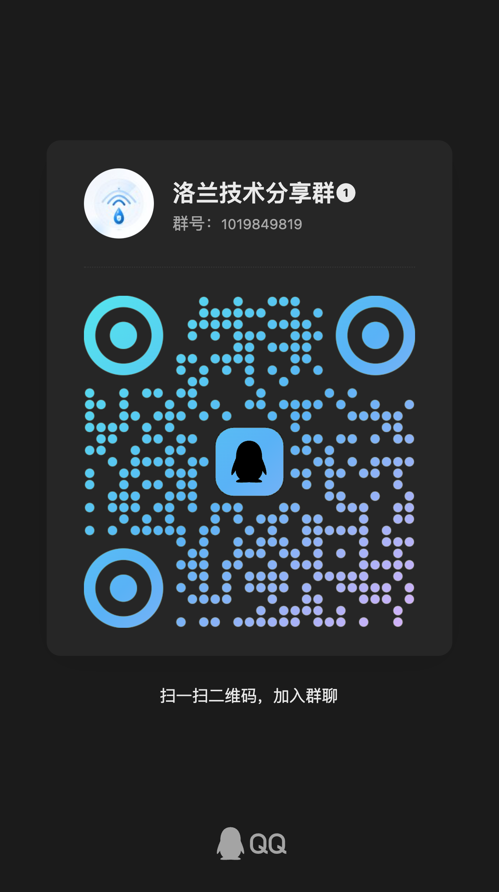

# UFI-TOOLS-assets

UFI-TOOLS 相关资源文件仓库，主要用于存放项目所需的静态资产、配置文件、接口数据以及其他辅助文件。

> 本仓库内容会根据项目需求持续更新，欢迎关注与反馈。

---

## ⭐ 推荐加入交流群

如果你正在使用 UFI-TOOLS，或者想第一时间获取：

- 最新资源更新
- 使用教程与配置说明
- 问题反馈与解决方案
- 项目进度通知
- 其他用户的经验分享

**强烈建议加入我的 QQ 群。**

### QQ 群号
`1019849819`

### QQ 群二维码


> 说明：资源更新、使用说明和重要通知会优先在群内同步，建议及时加入，避免错过最新内容。

---

## 说明

本仓库主要用于：

- 存放 UFI-TOOLS 相关资源文件
- 提供版本化的配置与数据支持
- 方便相关工具或脚本直接引用
- 作为项目配套资源的统一管理仓库

---

## 使用方式

如果你的项目需要引用这里的资源，可以直接通过仓库文件路径访问对应内容，或按项目实际需求下载后使用。

例如：

```bash
# 示例：下载某个文件
https://raw.githubusercontent.com/qybgh/UFI-TOOLS-assets/main/文件路径
```

---

## 反馈与建议

如果你发现：

- 文件缺失
- 内容错误
- 资源不可用
- 有更好的建议

欢迎通过 Issue 或交流群反馈，我会尽量及时处理。

---

## 免责声明

本仓库内容仅用于学习、交流与项目辅助使用。  
如有任何内容涉及版权或其他问题，请及时联系我处理。

---

## Star 支持

如果这个仓库对你有帮助，欢迎点个 Star 支持一下，这会鼓励我继续维护和更新资源。
